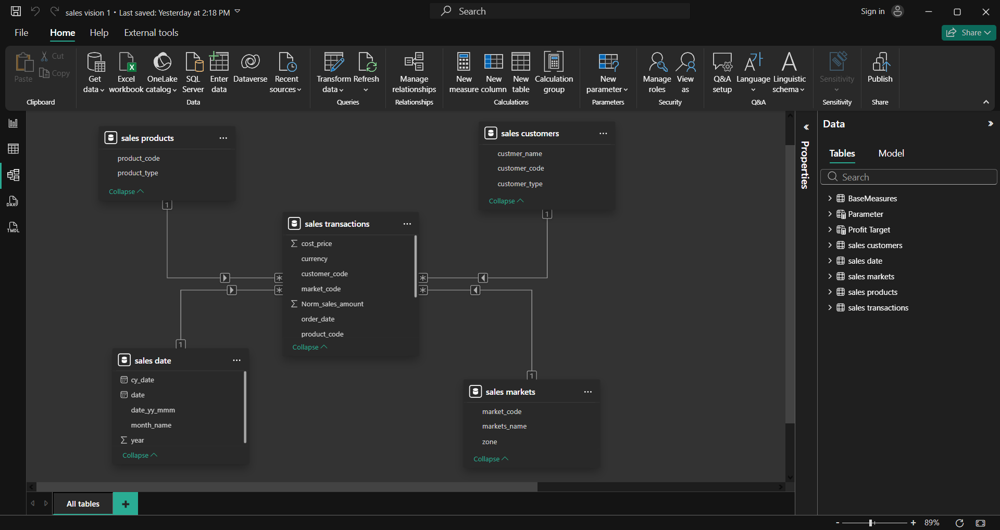

# sales-vision-powerbi-dashboard
# 📊 Sales Vision: Market & Profitability Insights Dashboard

---

## 1. Project Title 

**Sales Vision – Market & Profitability Insights Dashboard**
An interactive sales analytics dashboard built using SQL and Power BI to provide a clear, data-driven view of revenue, profitability, customer performance, and market trends.

---

## 📌 Table of Contents
1. [Project Title](#1-project-title)
2. [Purpose](#2-purpose)
3. [Tech Stack](#3-tech-stack)
4. [Data Source](#4-data-source)
5. [Data Structure](#5-data-structure)
6. [ETL Process Highlights](#6-etl-process-highlights)
7. [Key KPIs](#7-key-kpis)
8. [Dashboard Walkthrough](#8-dashboard-walkthrough)
9. [Business Value Delivered](#9-business-value-delivered)
10. [Key Takeaways](#10-key-takeaways)
11. [Final Conclusion](#11-final-conclusion)

---

 Formats** – `.pbix`, `.png`

---

## 4. Data Source
**Source:** https://codebasics.io/resources/sales-insights-data-analysis-project

Contains multi-year transactional sales data across customers, markets, and products — structured to enable revenue, profitability & trend analysis.

---

## 5. Data Structure

Star-schema model optimized for analytics:

### **Fact Table**
- `transactions`

### **Dimension Tables**
- `customers`
- `products`
- `markets`
- `date`

**Data Modeling:**  
Relationships are established using foreign keys connecting `transactions` to each dimension.

---

## 6. ETL Process Highlights

### **Extract**
- Imported `db_dump.sql` into MySQL
- Queried `transactions`, `customers`, `date` tables

### **Transform**
- Cleaned currency inconsistencies (`INR` / `USD`)
- Normalized USD → INR

```powerquery
= Table.AddColumn(
    #"Filtered Rows",
    "norm_amount",
    each if [currency] = "USD" or [currency] = "USD#(cr)"
    then [sales_amount] * 75
    else [sales_amount],
    type any
)

## 2. Purpose

Sales Vision is a comprehensive business intelligence dashboard designed to help stakeholders monitor sales performance, identify profit optimization opportunities, and understand customer and market dynamics. It transforms raw transactional data into actionable insights for faster and smarter decision-making.

---

## 3. Tech Stack

The dashboard was built using the following tools and technologies:

* 📊 **Power BI Desktop** – Interactive data visualization and reporting
* 📂 **Power Query** – Data extraction, cleaning, and transformation
* 🧠 **DAX (Data Analysis Expressions)** – Calculated KPIs, profit metrics, and dynamic filtering
* 🛢️ **MySQL** – Backend database for storing and querying transactional data
* 🧩 **Data Modeling** – Star-schema relationships between fact and dimension tables
* 📁 **File Formats** – `.pbix` for development and `.png` for dashboard previews

---

## 4. Data Source

**Source:** https://codebasics.io/resources/sales-insights-data-analysis-project

The dataset contains multi-year transactional sales data across customers, products, and markets. It is structured to simulate real-world business operations and supports revenue, profitability, and trend analysis.

---

## 5. Data Structure

The data follows a **star-schema model** optimized for analytics and reporting.

**Fact Table**

* `transactions`

**Dimension Tables**

* `customers`
* `products`
* `markets`
* `date`




Relationships are established between the transactions table and each dimension table using respective keys.

---

## 6. ETL Process Highlights

### • Extract

* Imported database dump (`db_dump.sql`) into MySQL
* Queried data from transactions, customers, and date tables

### • Transform

* Cleaned currency inconsistencies (INR / USD)
* Normalized USD values into INR using a fixed conversion rate
* Created calculated columns and measures for revenue, profit, margins, and contributions

**Currency Normalization Logic (Power Query):**

```powerquery
= Table.AddColumn(
    #"Filtered Rows",
    "norm_amount",
    each if [currency] = "USD" or [currency] = "USD#(cr)"
    then [sales_amount] * 75
    else [sales_amount],
    type any
)
```

### • Load

* Loaded transformed data into Power BI
* Established relationships between fact and dimension tables

---

## 7. Key KPIs

* **Total Revenue (₹)**
* **Total Profit (₹)**
* **Overall Profit Margin %**
* **Total Sales Quantity**
* **Average Order Value (AOV)**
* **Revenue Contribution by Market %**
* **Profit Contribution by Market %**
* **Top Customers Revenue Share %**
* **High Revenue–Low Profit Markets**
* **Peak & Lowest Revenue Months**

---

## 8. Dashboard Walkthrough

### Top KPIs

Displays total revenue, sales quantity, and overall profit margin to provide a high-level snapshot of business performance.

### Revenue & Profit Trends

* Monthly revenue trends across years
* Profit margin % overlay to track efficiency
* Helps identify seasonality and revenue declines

### Market-wise Analysis

* Revenue Contribution % by Market
* Profit % by Market
* Profit Contribution % by Market

Highlights high-revenue but low-profit regions and identifies optimization opportunities.

### Customer & Product Insights

* Top 5 Customers by Revenue
* Top 5 Products by Revenue

Reveals revenue concentration and dependency risks.

### Filters & Interactivity

* Year slicer (2017–2020)
* Month slicer
* Dynamic profit target slider

Allows stakeholders to explore performance from multiple perspectives.

---

## 9. Business Value Delivered

* **Revenue Risk Reduction (~25–30%)**: Exposed heavy dependency on a small group of customers and markets, enabling diversification planning that reduces revenue concentration risk and improves business stability.

* **Profit Margin Improvement Potential (~8–12%)**: Highlighted high-revenue but low-margin markets, shifting focus toward margin-led decision-making rather than topline-only growth.

* **Market Expansion Efficiency Gain (~15–20%)**: Identified high-margin, under-penetrated markets, allowing leadership to prioritize regions with stronger return on investment.

* **Product Portfolio Optimization (~10–15%)**: Revealed revenue concentration across a limited product set, supporting balanced promotion of mid-tier products to reduce dependency risk.

* **Seasonal Planning Accuracy (~20%)**: Clear visibility into revenue peaks and dips improves forecasting, inventory alignment, and promotional timing.

* **Customer Profitability Focus (~12–18%)**: Enabled prioritization of high-margin customers over high-volume, low-profit accounts, improving overall contribution quality.

---

## 10. Key Takeaways

* Enables faster, data-driven decision-making
* Improves visibility into revenue and profitability drivers
* Identifies cost-inefficient markets and customers
* Supports strategic planning and performance optimization

---

## 11. Final Conclusion

Sales Vision demonstrates an end-to-end data analytics workflow, combining SQL-based analysis, ETL processing, and interactive Power BI dashboards to deliver business-ready insights. The project highlights strong analytical, visualization, and storytelling skills aligned with real-world business needs.

---

